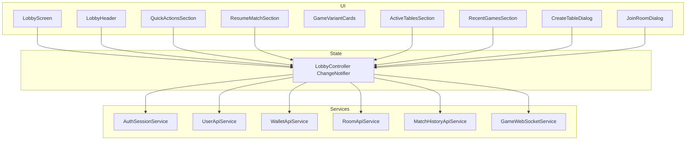
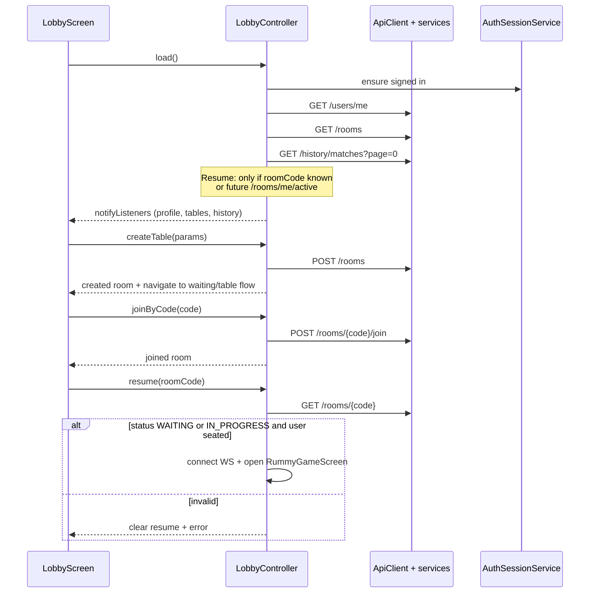
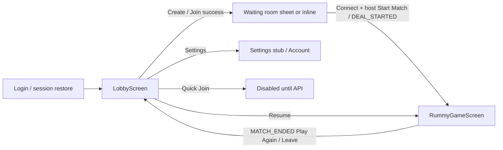

# LobbyScreen — Design Document (approval required)

**Project:** Trust Rummy  
**Status:** Design approved — MVP implemented on `feature/lobby-screen-mvp`  
**Date:** 2026-07-22

See also: `docs/LOBBY_API_GAPS.md`.

## Approval decisions (locked)

1. `LobbyController` (`ChangeNotifier`) — **yes**
2. `LobbyScreen` post-login landing — **yes**
3. Resume v1 via local `roomCode` — **yes**
4. Quick Join disabled — **yes**
5. No Public/Private UI — **yes**
6. No N+1 seat counts — **yes**
7. Dedicated `WaitingRoomScreen` after create/join — **yes**
8. MVP + secondary Active Tables / Recent Games from existing list/history APIs — **yes**


---

## 1. Current architecture (summary)

| Layer | Today |
|--------|--------|
| Routing | Imperative `Navigator` only; `home: HomeScreen` (dev tools). **No post-login product screen.** |
| State | `StatefulWidget` + `setState`; `AuthSessionService` is the only `ChangeNotifier` singleton. Provider is in `pubspec` but unused. |
| Networking | Services + `ApiClient` (session refresh). No repositories/fakes. |
| Lobby today | Embedded in `GameTestScreen` (create/join/connect/start → `RummyGameScreen`). |
| Theme | Material 3 dark (`0xFF0F172A` scaffold, seed `0xFF6C5CE7`); table uses separate `RummyColors`. |

**Proposed state approach (fits the project):** a `LobbyController extends ChangeNotifier` (same pattern as `AuthSessionService`), owned above the screen, with UI as dumb widgets listening via `ListenableBuilder`. No Riverpod/Bloc. No business logic in widgets.

### Flutter architecture notes

| Topic | Detail |
|--------|--------|
| Entry | `lib/main.dart` → `AuthSessionService.restore()` → `TrustRummyApp` → `HomeScreen` |
| Screens | `HomeScreen`, `GameTestScreen`, `RummyGameScreen`, `AccountTestScreen`, `TelemetryScreen`, `RummyTableMockupScreen` |
| Services | `RoomApiService`, `UserApiService`, `WalletApiService`, `MatchHistoryApiService`, `AuthApiService`, `AuthSessionService`, `GameWebSocketService` |
| Auth path | Session Bearer via `ApiClient` (refresh on expiry/401). Auth mint endpoints use raw HTTP. |

---

## 2. Backend APIs available vs needed

### 2.1 Available (use these)

| Need | API |
|------|-----|
| Header user + balance | `GET /api/v1/users/me` |
| Balance refresh | `GET /api/v1/wallet/balance` |
| Create table | `POST /api/v1/rooms` (`gameVariant`, `maxPlayers`, `stakeAmount`, `dealsPerMatch` for DEALS) |
| Join by code | `POST /api/v1/rooms/{code}/join` |
| Room detail | `GET /api/v1/rooms/{code}` (includes `players[]`) |
| Leave / cancel (WAITING) | `POST .../leave`, `DELETE .../{code}` |
| Open WAITING list | `GET /api/v1/rooms` (**no `players`, no seat count, no filters**) |
| Recent games | `GET /api/v1/history/matches` |
| Enter table | WS `/ws/game/{roomCode}?token=` then host `START_MATCH` (unchanged) |

### 2.2 Room lifecycle (existing)

```
WAITING --(host START_MATCH via WS)--> IN_PROGRESS --> COMPLETED
WAITING --(host leave/cancel / stale reaper)--> CANCELLED
```

- Create auto-seats host at seat `0`.
- Join REST seats others; WS connect does **not** seat.
- Leave/cancel only while `WAITING`.
- After start, leave via WS `LEAVE_TABLE`.

### 2.3 Gaps (do **not** invent client-side)

| Feature | Gap | Proposed backend (for later approval) |
|---------|-----|--------------------------------------|
| **Public / Private** | No visibility field on `GameRoom` / create / list | Add `visibility: PUBLIC \| PRIVATE`; list only PUBLIC (+ rooms user is in); private join still by code |
| **Resume Match** | No “my active room” API; no `findByUserId` on seats | `GET /api/v1/rooms/me/active` → room if user has non-LEFT seat on `WAITING` or `IN_PROGRESS` |
| **Quick Join** | No matchmaking | `POST /api/v1/rooms/quick-join` `{gameVariant, stakeAmount?}` or filter+auto-join |
| **Active Tables richness** | List lacks seated count / host | Enrich list DTO: `seatedCount`, `hostUsername` (or allow `?includePlayers=true`) |
| **Avatar** | Profile has no avatar URL | Initials avatar for v1; optional `avatarUrl` later |
| **Settings** | No settings screen | Header button → stub or existing account screen |

---

## 3. Widget hierarchy

```text
LobbyScreen
├── LobbyHeader
│   ├── Avatar (initials from displayName/username)
│   ├── Username / displayName
│   ├── WalletBalanceCard
│   └── Settings IconButton
├── (body: CustomScrollView / responsive split)
│   ├── QuickActionsSection
│   │   ├── Quick Join  → gap handling (disabled + tooltip OR opens variant picker then documents gap)
│   │   ├── Create Table → CreateTableDialog
│   │   └── Join With Room Code → JoinRoomDialog
│   ├── ResumeMatchSection          // only if active room resolved
│   ├── GameVariantsSection
│   │   └── GameVariantCard × 4 (Points, Deals, Pool 101, Pool 201)
│   ├── ActiveTablesSection         // GET /rooms + empty/enriched UI
│   └── RecentGamesSection          // GET /history/matches
├── CreateTableDialog (modal)
└── JoinRoomDialog (modal)
```

**Reusable widgets (deliverables):**

- `LobbyScreen`
- `LobbyHeader`
- `WalletBalanceCard`
- `QuickActionsSection`
- `ResumeMatchSection`
- `GameVariantCard`
- `ActiveTablesSection`
- `RecentGamesSection`
- `CreateTableDialog`
- `JoinRoomDialog`

Responsive: single column on mobile; on desktop, variants + tables in a wider grid / two-pane under the header.

Material 3, dark-theme compatible, preserve app seed / scaffold colors; do not invent a second brand system.

---

## 4. Screen architecture diagram



**Rules:**

- Networking stays in services / controller — not in widgets.
- No mock data, fake repositories, or invented endpoints.
- Controller holds loading/error/profile/tables/history/resume snapshot.

---

## 5. Data flow diagram



### Create Table → Private (provisional)

Today every room is effectively “code joinable.” UI can label Private as “share room code” without a backend flag; Public means “appears in Active Tables.” Until visibility exists, **Create with Public still uses the same create API**; list shows all WAITING rooms (current server behavior). Call this out in UI copy as provisional.

### CreateTableDialog fields

| Field | UI | Backend today |
|-------|-----|----------------|
| Variant | Points / Deals / Pool 101 / Pool 201 | `gameVariant` |
| Players | 2–6 | `maxPlayers` |
| Deals count | Visible only for Deals | `dealsPerMatch` (DEALS only) |
| Entry fee | Virtual credits | `stakeAmount` |
| Room type | Public / Private | **No field** — UI-only until gap closed |

No real-money payments, deposits, or withdrawals in this flow.

### JoinRoomDialog

- Enter room code
- Client format validation (6-char code alphabet used by backend)
- `POST /rooms/{code}/join`
- Surface server errors (404 / 409 full / not WAITING)

---

## 6. Navigation flow diagram



**Post-login change (when implementing):** `MaterialApp.home` (or a thin auth gate) → `LobbyScreen` if signed in, else login. Keep `HomeScreen` reachable behind a debug flag or Settings → “Dev tools” so test harnesses are not lost.

---

## 7. Feature × API matrix

| UI section | Implement now? | Data source |
|------------|----------------|-------------|
| Header (name, balance) | Yes | `GET /users/me` |
| WalletBalanceCard | Yes | same / optional balance poll |
| Create Table | Yes | `POST /rooms` |
| Join With Code | Yes | `POST /rooms/{code}/join` |
| Variant cards | Yes | Static copy + optional preselect for Create dialog |
| Active Tables | Yes (partial) | `GET /rooms`; Join → `join` then detail; **seat count** requires extra `GET /{code}` per row or show `—/maxPlayers` until API enriched |
| Recent Games | Yes | `GET /history/matches` |
| Resume Match | **Partial** | Persist last `roomCode` in secure prefs after create/join; on load `GET /rooms/{code}` if user still seated and status `WAITING`/`IN_PROGRESS`. **Not** a full server-side resume API |
| Quick Join | **UI only** | Disabled + “Coming soon” until matchmaking API |
| Public/Private | **UI only for Private semantics** | No filter until visibility field exists |

### Recent Games row mapping (`MatchHistoryItem`)

| UI | Field |
|----|--------|
| Date | `endedAt` / `startedAt` |
| Variant | `gameVariant` |
| Result | Win if `winnerUsername` == me; else loss/abort from `status` |
| Score | `myFinalScore` |

---

## 8. Decisions needing approval

1. **Architecture:** Introduce `LobbyController` (`ChangeNotifier`) — OK?
2. **Post-login home:** Replace `HomeScreen` with auth-gated `LobbyScreen` (dev tools via Settings)?
3. **Resume without new API:** Client-remembered `roomCode` + `getRoom` — acceptable for v1, with gap doc for `GET /rooms/me/active`?
4. **Quick Join:** Disabled control documenting gap (no fake matchmaking)?
5. **Public/Private:** UI toggle that only affects messaging until backend visibility exists (Private = don’t expect list discovery; still same create API)?
6. **Active table seat counts:** Show `?/maxPlayers` from list only, or N+1 `getRoom` for each visible row (heavier)?
7. **Create → next screen:** Stay on lobby with “Your table” panel vs navigate to a dedicated waiting room before `RummyGameScreen`?

---

## 9. Implementation deliverables (after approval)

- Widgets listed above under `lib/screens/lobby/` + `lib/widgets/lobby/`
- `LobbyController` + wire existing services (no mocks)
- Dialogs: CreateTable / JoinRoom
- Nav from login → lobby → existing `RummyGameScreen`
- Gap documentation: `docs/LOBBY_API_GAPS.md` (and/or a short section in `RULES_ENGINE.md`)

---

## 10. Constraints (from product brief)

- Do not use mock data.
- Do not create fake repositories.
- Do not invent backend APIs.
- Use existing APIs where available.
- If an API does not exist, identify the gap and propose backend changes (see §2.3).
- Follow existing project architecture.
- Keep networking outside UI widgets.
- No business logic inside widgets.
- Material 3.
- Responsive desktop/mobile layout.
- Dark theme compatible.
- Do not automatically create a room on lobby load.
- Do not implement real-money payments, deposits, or withdrawals in lobby flows.

---

## 11. Approval checklist

- [ ] §8.1 LobbyController
- [ ] §8.2 Post-login LobbyScreen
- [ ] §8.3 Client-side resume v1
- [ ] §8.4 Quick Join disabled
- [ ] §8.5 Public/Private UI-only
- [ ] §8.6 Seat count strategy
- [ ] §8.7 Post-create waiting UX

**Next step:** Reply with approvals / preferred options on §8, then implementation may begin.

## Author: Eswaraiah
## Provided approvals for above analysis

Approved with the following changes:

1. Use LobbyController (ChangeNotifier).

2. LobbyScreen becomes post-login landing screen.

3. Resume Match v1 may use locally persisted roomCode.

4. Quick Join remains disabled (Coming Soon).

5. Remove Public/Private from MVP implementation.
   Do not add UI for features that do not exist in backend.

6. Do not perform N+1 room detail requests for seat counts.
   Use existing room list data only.

7. After Create Room or Join Room, navigate to a dedicated WaitingRoomScreen.
   Do not keep waiting-room state inside the lobby.

8. Implement MVP Lobby first:
    - Header
    - Wallet balance
    - Create Room
    - Join Room
    - Resume Match
    - Waiting Room

9. Active Tables and Recent Games may be implemented as secondary sections only if existing APIs support them cleanly.

Proceed with implementation.